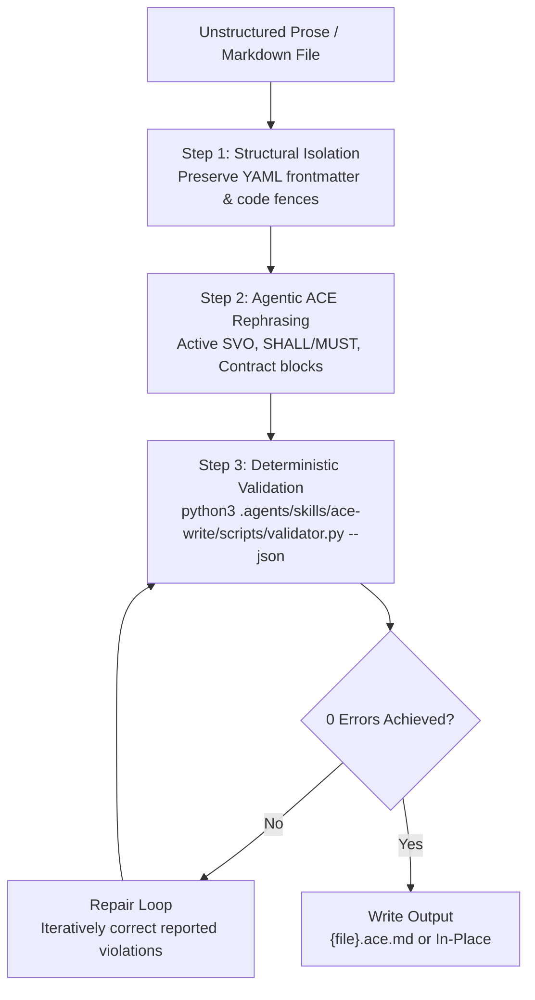

# ACE-Write: Agentic ACE Specification & Rephrasing Skill

The agent SHALL transform unstructured prose, instructions, and skill definitions into deterministic **Agentic ACE** (Attempto Controlled English Extension).



## 1. Dialect & Linguistic Invariants

Every rephrased statement MUST strictly obey these core linguistic invariants:

### Rule 1: Subject-Verb-Object (SVO) Active Voice
Every declarative sentence MUST have an explicit subject performing an active verb upon an object.

```text
[FORBIDDEN: Passive]: The task is executed by the agent.
[REQUIRED: Active SVO]: The agent executes the task.
```

### Rule 2: Strict Modal Verbs
Permitted modals are: `SHALL`, `SHALL NOT`, `MUST`, `MUST NOT`.
Forbidden modals are: `should`, `could`, `might`, `would`, `may`, `probably`, `possibly`, `maybe`, `ought`.

```text
[FORBIDDEN]: The script should validate the schema.
[REQUIRED]: The script SHALL validate the schema.
```

### Rule 3: Deterministic Conditionals
Conditionals MUST follow explicit `IF ... THEN` or `WHEN ... THEN` syntax.

```text
[FORBIDDEN]: Run cleanup if the process fails.
[REQUIRED]: IF the process fails, THEN the agent SHALL invoke the cleanup procedure.
```

### Rule 4: Agentic Contract Blocks
The agent SHALL structure procedural requirements, tool calls, and state transitions using uppercase contract blocks:

```markdown
GIVEN <precondition or initial state>
WHEN <trigger event or user request>
THEN <required action, tool execution, or postcondition>
INVARIANT <immutable rule that MUST NOT be violated>
```

### Rule 5: Atomic Sentences and Banned Ambiguity
Sentences MUST NOT exceed 25 words. The author SHALL split chained compound clauses into atomic sentences.
The author SHALL NOT use vague qualifiers or open-ended fillers. The author SHALL replace vague terms with explicit numeric thresholds or concrete identifiers.

### Rule 6: Prohibited Dashes and Punctuation Ambiguity
The author SHALL NOT use em-dashes (`—`), en-dashes (`–`), or horizontal rule dividers (`---`).
The agent SHALL proactively delete all em-dashes, en-dashes, and horizontal rule dividers.
The agent SHALL use standard markdown headers (`##`, `###`) for section separation.

## 2. Operational Procedures

### Procedure A: Inline Text and Prompt Transformation
WHEN a user or agent provides raw text:
1. The agent SHALL isolate all code snippets and structured data payloads.
2. The agent SHALL rephrase all prose sentences into active SVO and Agentic ACE contract blocks.
3. The agent SHALL proactively delete all em-dashes, en-dashes, and horizontal rule dividers from prose.
4. The agent SHALL verify the candidate text with the validator tool:
   ```bash
   echo "<candidate_text>" | python3 .agents/skills/ace-write/scripts/validator.py --json
   ```
5. The agent SHALL resolve all reported diagnostic errors until 0 errors remain.
6. The agent SHALL return the verified text.

### Procedure B: Single File Transformation
WHEN the user or agent provides a target file path:
1. The agent SHALL read the target file using the file viewer tool.
2. The agent SHALL preserve YAML frontmatter headers, code fences, and tables verbatim.
3. The agent SHALL rephrase markdown headers, instructions, list items, and paragraphs into Agentic ACE.
4. The agent SHALL proactively delete all em-dashes, en-dashes, and horizontal rule dividers from prose.
5. The agent SHALL determine the output destination:
   - IF the user provides `--in-place`, THEN the agent SHALL overwrite the original file.
   - IF the user does not provide `--in-place`, THEN the agent SHALL write to `{directory}/{stem}.ace.md`.
6. The agent SHALL validate the destination file:
   ```bash
   python3 .agents/skills/ace-write/scripts/validator.py <target_path> --json
   ```
7. IF the validator reports violations, THEN the agent SHALL apply iterative corrections until the file passes.

### Procedure C: Directory Batch Processing
WHEN the user provides a directory path:
1. The agent SHALL locate all markdown files within the target directory.
2. The agent SHALL execute Procedure B on each discovered file.
3. The agent SHALL run batch validation across the directory:
   ```bash
   python3 .agents/skills/ace-write/scripts/validator.py <directory_path>
   ```

### Procedure D: Conformance Linting
WHEN the user requests a dry-run check without modifying files:
1. The agent SHALL execute the validator in check mode:
   ```bash
   python3 .agents/skills/ace-write/scripts/validator.py <target_path>
   ```
2. The agent SHALL report all discovered violations.

## 3. Transformation Reference Examples

### Example 1: Server Configuration Procedure
```text
[SOURCE]: Users should probably configure their API key before running the server. The server is then started by executing npm start. Various options can also be passed if necessary.

[REPHRASED AGENTIC ACE]:
GIVEN the environment contains a valid API key.
WHEN the user executes `npm start`.
THEN the system SHALL initialize the server on port 3000.
INVARIANT the server SHALL NOT accept requests without a valid API key.
```

### Example 2: Error Recovery Workflow
```text
[SOURCE]: When the test fails, an error report should be generated. The agent might try to fix simple typos automatically, etc.

[REPHRASED AGENTIC ACE]:
IF the test suite returns a non-zero exit code, THEN the agent SHALL generate an error report.
The agent SHALL inspect syntax error line numbers.
The agent SHALL apply automated corrections to syntax errors.
```

## 4. Verification Checklist

WHEN completing any task with the `ace-write` skill, THEN the agent SHALL verify:
1. `python3 .agents/skills/ace-write/scripts/validator.py <file>` returns exit code 0.
2. Zero passive voice constructs remain in prose.
3. Zero em-dashes (`—`), en-dashes (`–`), or horizontal dividers (`---`) remain in prose.
4. Every requirement uses `SHALL` or `MUST`.
5. All code blocks and YAML frontmatter match original contents verbatim.
