# Master Agile Orchestrator Skill

The agent SHALL orchestrate the complete software engineering lifecycle across five sequential phases:
Define, Review, Implement, Verify, and Repeat.
The agent SHALL coordinate handovers across six persona skills: `po`, `ux-designer`, `architect`, `developer`, `qa`, and `scrum-master`.
The human acts as the Stakeholder and retains primary decision-making authority across four mandatory quality gates.

```mermaid
flowchart TD
    Start["User Invokes /agile"] --> InitSprint["Detect Next Sprint (e.g. sprint-{N}) & Scaffold 6 Subdirectories"]
    InitSprint --> Phase1["Phase 1: DEFINE<br/>1. po skill generates 01-stories/spec.md<br/>2. ux-designer skill generates 02-design/design-spec.md"]
    Phase1 --> Gate1{"Gate 1: Stakeholder Signoff on Requirements & UX Design?"}
    Gate1 -->|Approved| Phase2["Phase 2: REVIEW & PLAN<br/>architect skill generates 03-architecture/tech-spec.md and 04-tasks/plan.md"]
    Phase2 --> Gate2{"Gate 2: Stakeholder Signoff on Architecture & Implementation Plan?"}
    Gate2 -->|Approved| Phase3["Phase 3: IMPLEMENT<br/>developer skill executes atomic tasks (<= 4h) in active.md, archives, and outputs dev-summary.md"]
    Phase3 --> Phase4["Phase 4: VERIFY<br/>qa skill executes test suites and 8-concern code review in 05-reviews/"]
    Phase4 --> Gate3{"Gate 3: Stakeholder Signoff on QA Report & Zero Blockers?"}
    Gate3 -->|Approved| Phase5["Phase 5: RELEASE & REPEAT<br/>scrum-master skill authors release notes, retrospective, and stages diff"]
    Phase5 --> Gate4{"Gate 4: Stakeholder Signoff on Git Commit Execution?"}
    Gate4 -->|Approved| CommitExec["Execute git commit, update backlog.md to DONE, and prompt next sprint"]
```

## 1. Specification Invariants

The agent MUST enforce the following invariants during sprint orchestration:

### Rule 1: Sequential Lifecycle Progression
The agent SHALL NOT initiate a downstream phase until the preceding phase completes and passes its deterministic validator and Stakeholder gate.
The sequence of execution MUST strictly follow:
1. `po` $\longrightarrow$ `ux-designer` (Phase 1: Define)
2. `architect` (Phase 2: Review / Plan)
3. `developer` (Phase 3: Implement)
4. `qa` (Phase 4: Verify)
5. `scrum-master` (Phase 5: Release / Repeat)

### Rule 2: Four Mandatory Stakeholder Human-in-the-Loop Gates
INVARIANT the agent SHALL NOT advance past any quality gate without explicit human authorization:
- **Gate 1 (Requirements & UX)**: Human approves `01-stories/spec.md` and `02-design/design-spec.md`.
- **Gate 2 (Technical Architecture & Plan)**: Human approves `03-architecture/tech-spec.md` and `04-tasks/plan.md`.
- **Gate 3 (Verification & Review)**: Human approves `05-reviews/{DATE}_{slug}.md` with zero unresolved blockers.
- **Gate 4 (Release & Commit)**: Human approves conventional commit messages, staged diffs, and sprint completion.

### Rule 3: Sprint Directory Hierarchy Standard
The agent SHALL house all sprint artifacts under `docs/.prompts-and-prayers/sprints/sprint-{N}/`:
- `01-stories/`: Product Owner specifications and acceptance criteria.
- `02-design/`: UX Designer interaction flows and state diagrams.
- `03-architecture/`: Technical architecture specifications and ADRs.
- `04-tasks/`: Macro implementation plan, active atomic task, and task archive.
- `05-reviews/`: Automated test logs and 8-concern code review reports.
- `06-release/`: Sprint release notes, retrospectives, and commit logs.

### Rule 4: Dual Mode Co-Existence
The master orchestrator skill SHALL guide the complete sprint process from start to finish.
The agent SHALL also support standalone persona invocations (`/po`, `/ux-designer`, `/architect`, `/developer`, `/qa`, `/scrum-master`) for ad-hoc or targeted tasks.

## 2. Execution Procedure

GIVEN a user request to run a sprint
WHEN the user invokes `/agile`
THEN the agent SHALL execute the following sequential steps:

### Step 1: Sprint Scaffolding and Backlog Ingestion
The agent SHALL inspect `docs/.prompts-and-prayers/sprints/` to identify the next sequential sprint identifier (for example `sprint-1`).
The agent SHALL create the sprint directory hierarchy containing all six numbered subdirectories.
IF the user prompt references a backlog identifier (for example `BL-001`), THEN the agent SHALL load requirements from `docs/.prompts-and-prayers/backlog/backlog.md`.
IF the prompt omits requirements, THEN the agent SHALL inspect the backlog and prompt the user to select an open item.

### Step 2: Phase 1 - Define (PO & UX Designer)
The agent SHALL activate the `po` skill to generate `01-stories/spec.md`.
The agent SHALL run the PO validator to verify zero errors.
The agent SHALL activate the `ux-designer` skill to generate `02-design/design-spec.md`.
The agent SHALL run the UX Designer validator to verify zero errors.

### Step 3: Gate 1 Checkpoint
The agent SHALL present links to both `01-stories/spec.md` and `02-design/design-spec.md` to the Stakeholder.
The agent SHALL halt autonomous execution and await Stakeholder approval.
WHEN the Stakeholder provides approval, THEN the agent SHALL update frontmatter statuses to `APPROVED`.

### Step 4: Phase 2 - Review & Plan (Architect)
The agent SHALL activate the `architect` skill to author `03-architecture/tech-spec.md` and `04-tasks/plan.md`.
The agent SHALL run the Architect validator to verify zero errors and complete story traceability.

### Step 5: Gate 2 Checkpoint
The agent SHALL present links to `03-architecture/tech-spec.md` and `04-tasks/plan.md` to the Stakeholder.
The agent SHALL halt autonomous execution and await Stakeholder approval.
WHEN the Stakeholder provides approval, THEN the agent SHALL update frontmatter statuses to `APPROVED`.

### Step 6: Phase 3 - Implement (Developer)
The agent SHALL activate the `developer` skill.
The agent SHALL execute unblocked tasks from `04-tasks/plan.md` sequentially.
For each task, the agent SHALL decompose an atomic task ($\le$ 4 hours effort) into `04-tasks/active.md`, author code and tests in `tests/`, verify exit code zero, and archive the record to `04-tasks/archive/`.
WHEN all plan tasks complete, THEN the agent SHALL generate `04-tasks/dev-summary.md`.

### Step 7: Phase 4 - Verify (QA)
The agent SHALL activate the `qa` skill.
The agent SHALL run `python3 -m unittest discover tests`.
The agent SHALL inspect `git diff` and evaluate all eight concerns defined in the `review` skill.
The agent SHALL author `05-reviews/{YYYY-MM-DD}_{slug}.md`.
The agent SHALL run the QA validator to verify zero formatting errors and zero blocker status.

### Step 8: Gate 3 Checkpoint
The agent SHALL present the link to the QA review report to the Stakeholder.
The agent SHALL halt autonomous execution and await Stakeholder approval.
WHEN the Stakeholder provides approval, THEN the agent SHALL update the report status to `APPROVED`.

### Step 9: Phase 5 - Release & Repeat (Scrum Master)
The agent SHALL activate the `scrum-master` skill.
The agent SHALL author `06-release/release-notes.md` and `06-release/retrospective.md`.
The agent SHALL activate the `commit` skill to stage files and generate Conventional Commit messages.

### Step 10: Gate 4 Checkpoint and Commit Execution
The agent SHALL present the staged diff and proposed commit messages to the Stakeholder.
INVARIANT the agent SHALL NOT execute `git commit` until the Stakeholder confirms authorization.
WHEN the Stakeholder authorizes the release, THEN the agent SHALL execute `git commit`.
The agent SHALL update the active sprint item in `docs/.prompts-and-prayers/backlog/backlog.md` to `DONE`.
The agent SHALL display a release summary and prompt the user to start the subsequent sprint.
