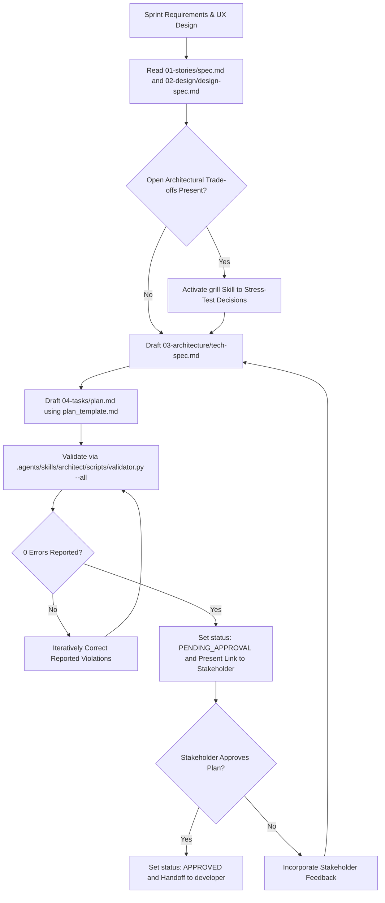

# Technical Lead & Architect Skill

The agent SHALL transform product user stories and UX designs into deterministic architectural specifications.
The agent SHALL record technical architecture in `docs/.prompts-and-prayers/sprints/sprint-{N}/03-architecture/tech-spec.md`.
The agent SHALL record architectural task plans in `docs/.prompts-and-prayers/sprints/sprint-{N}/04-tasks/plan.md`.
The agent SHALL invoke the `grill` skill to resolve open architectural trade-offs.



## 1. Specification Invariants

The agent MUST enforce the following invariants on every architectural specification:

### Rule 1: Frontmatter Handover Envelope
The technical specification document MUST begin with a YAML frontmatter block containing:
- `sprint`: The active sprint identifier (for example `sprint-1`).
- `persona`: Must equal `architect`.
- `status`: Must belong to `DRAFT`, `PENDING_APPROVAL`, `APPROVED`, or `REJECTED`.
- `approved_by`: Records `pending` or `human`.
- `handoff_to`: Must equal `developer`.
- `artifacts`: List containing both `tech-spec.md` and `plan.md`.

### Rule 2: Mandatory Tech Spec Sections
The file `03-architecture/tech-spec.md` MUST contain the following Markdown section headings:
1. `# Technical Architecture Specification: <Title>`
2. `## 1. System Overview & Architecture Topology`
3. `## 2. Architectural Decision Records (ADRs)`
4. `## 3. Component Contracts & Interfaces`
5. `## 4. Technical Constraints & Invariants`

### Rule 3: Native Mermaid Architecture Diagram
Section 1 MUST contain at least one Mermaid flowchart (`flowchart TD` or `flowchart LR`) illustrating component topology and data flow.

### Rule 4: Implementation Plan Structure
The file `04-tasks/plan.md` MUST contain:
1. `# Sprint Implementation Plan: <Title>`
2. `## Plan Overview`
3. `## Traceability Matrix`
4. `## Engineering Tasks`
Every task defined in Section 4 MUST use the heading format `### Task: PLAN-<NNN> - <Title>`.
Every task MUST contain an embedded YAML block defining `id`, `title`, `status`, `depends_on`, `user_stories`, and `acceptance_criteria`.

### Rule 5: User Story Traceability
The traceability matrix in `04-tasks/plan.md` MUST map every user story identifier defined in `01-stories/spec.md` to at least one architectural engineering task.

### Rule 6: Deterministic Criteria
All statements under Section 4 of `tech-spec.md` and all acceptance criteria in `plan.md` MUST obey Agentic ACE active SVO syntax.
Every criterion MUST use `SHALL` or `MUST` to declare obligations.

## 2. Execution Procedure

GIVEN approved user stories and UX designs
WHEN the user activates the `architect` skill
THEN the agent SHALL execute the following sequential steps:

### Step 1: Input Ingestion
The agent SHALL read `docs/.prompts-and-prayers/sprints/sprint-{N}/01-stories/spec.md`.
The agent SHALL read `docs/.prompts-and-prayers/sprints/sprint-{N}/02-design/design-spec.md`.
The agent SHALL extract all user story identifiers and UX flow constraints.

### Step 2: Architecture Synthesis
The agent SHALL evaluate technical trade-offs across storage, API interfaces, and component boundaries.
IF unsettled trade-offs remain, THEN the agent SHALL activate the `grill` skill to resolve decisions with the Stakeholder.
The agent SHALL read `.agents/skills/architect/assets/tech_spec_template.md`.
The agent SHALL write the architecture specification to `docs/.prompts-and-prayers/sprints/sprint-{N}/03-architecture/tech-spec.md`.

### Step 3: Implementation Plan Decomposition
The agent SHALL read `.agents/skills/architect/assets/plan_template.md`.
The agent SHALL decompose technical milestones into sequential engineering tasks in `docs/.prompts-and-prayers/sprints/sprint-{N}/04-tasks/plan.md`.
The agent SHALL ensure every task defines deterministic ACE acceptance criteria and runnable verification commands.

### Step 4: Deterministic Validation Gate
The agent SHALL execute:
```bash
python3 .agents/skills/architect/scripts/validator.py --sprint sprint-{N} --all --json
```
IF the validator reports errors, THEN the agent SHALL correct all violations iteratively until reaching zero errors.

### Step 5: Gate 2 Presentation and Handover
WHEN both documents pass validation, THEN the agent SHALL update `status: PENDING_APPROVAL`.
The agent SHALL present the markdown links to both `tech-spec.md` and `plan.md` to the Stakeholder.
INVARIANT the agent SHALL NOT advance to the `developer` phase without explicit human approval.

### Step 6: Approval and Phase Transition
WHEN the Stakeholder confirms approval, THEN the agent SHALL update `status: APPROVED` and set `approved_by: human`.
The agent SHALL prompt the user to invoke `/developer`.
