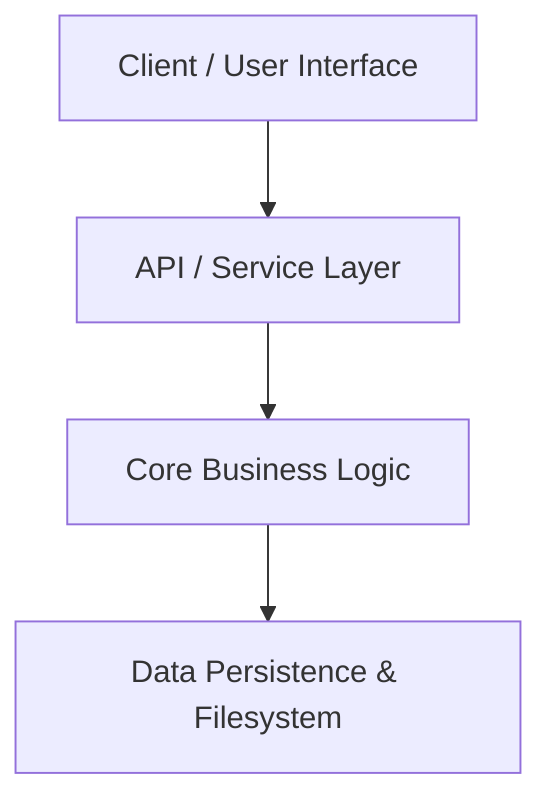

# Technical Architecture Specification: {FEATURE_TITLE}

## 1. System Overview & Architecture Topology

### System Context
{High-level architectural description of technical components and data flow.}

### Architecture Diagram

## 2. Architectural Decision Records (ADRs)

### ADR-001: {Decision Title}
- **Status**: Accepted
- **Context**: {Technical trade-off or challenge}
- **Decision**: {Chosen architectural option}
- **Rationale**: {Why this option was chosen over alternatives}

## 3. Component Contracts & Interfaces

### Component 1: {Name}
- **File Location**: `{path/to/file}`
- **Interface / API**:
  - Inputs: {parameters and types}
  - Outputs: {return types and structures}
- **Error Handling**: {behavior on failure}

## 4. Technical Constraints & Invariants

- The system SHALL execute all operations deterministically.
- All file modifications SHALL maintain backward compatibility unless a major version bump occurs.
- The system SHALL validate all input parameters against defined schemas.
