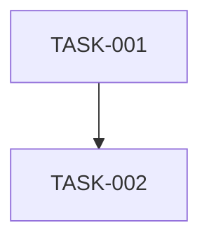

# Tasks

- [ ] **TASK-001: {Title}**
  - Depends on: None
  - Verify:
    - Command: {Verification command}
    - Criteria:
      - [ ] {Criterion 1}
      - [ ] {Criterion 2}

- [ ] **TASK-002: {Title}**
  - Depends on: TASK-001
  - Verify:
    - Command: {Verification command}
    - Criteria:
      - [ ] {Criterion 1}
      - [ ] {Criterion 2}
