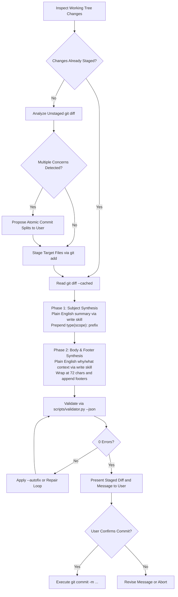

# Commit: Conventional Git Staging and Commit Generation Skill

The agent SHALL inspect repository changes, structure atomic staging batches, and generate Conventional Commit 1.0.0 messages.
The agent SHALL use the `write` skill to enforce Plain English standards across commit subjects and bodies.
INVARIANT the agent MUST obtain explicit user confirmation before executing any `git commit` command.



## 1. Specification and Linguistic Invariants

Every commit message generated by the agent MUST strictly satisfy these invariants:

### Rule 1: Conventional Commits 1.0.0 Syntax
The header MUST follow `<type>(<scope>): <subject>` or `<type>: <subject>` syntax.
The type MUST belong to the permitted set:
`feat`, `fix`, `docs`, `style`, `refactor`, `perf`, `test`, `build`, `ci`, `chore`, `revert`.
The scope MUST use lowercase alphanumeric characters with hyphens or slashes.
Breaking changes MUST include `!` before the colon or a `BREAKING CHANGE:` footer.

### Rule 2: Strict 50/72 Formatting Limits
The header length MUST NOT exceed 72 characters.
The agent SHALL target a header length of 50 characters or fewer.
A blank line MUST separate the header from the commit body and footers.
Every line within the commit body MUST NOT exceed 72 characters.

### Rule 3: Imperative Mood and Casing
The subject line MUST start with a lowercase letter.
The subject line MUST NOT end with a period.
The subject line MUST start with an imperative verb (for example `add`, `fix`, `update`, `refactor`, `remove`).
The agent SHALL NOT use past-tense or continuous verb forms.

### Rule 4: Mandatory Interactive Confirmation
The agent SHALL NOT execute `git commit` autonomously without explicit user approval.
The agent SHALL present the staged files, the diff summary, and the proposed commit message to the user.

### Rule 5: Exclusion of Local Task References
The agent SHALL NOT include local task identifiers (such as `TASK-001` or `TASK-xxx`) in commit headers, bodies, or footers.
The agent SHALL reserve issue footers (`Fixes #<id>`, `Closes #<id>`) strictly for external issue trackers.

## 2. Operational Procedures

### Procedure A: Working Tree Inspection and Staging
GIVEN uncommitted changes in the repository.
WHEN the user or agent invokes the `commit` skill:
1. The agent SHALL execute `git status --short` to inspect modified, deleted, and untracked files.
2. IF the staging area contains staged files, THEN the agent SHALL inspect the staged diff with `git diff --cached`.
3. IF the staging area contains zero files, THEN the agent SHALL inspect the unstaged diff with `git diff`.
4. The agent SHALL analyze whether the unstaged diff contains multiple independent concerns.
5. IF multiple independent concerns exist, THEN the agent SHALL propose splitting changes into atomic commit batches.
6. The agent SHALL stage the intended files using `git add <paths>`.

### Procedure B: Two-Phase Message Synthesis
WHEN staged changes are ready for commit drafting:
1. **Phase 1: Subject Synthesis**
   - The agent SHALL identify the primary change intent and the affected component.
   - The agent SHALL infer the conventional type and the lowercase scope.
   - The agent SHALL draft the action description in active Plain English using the `write` skill principles.
   - The agent SHALL prepend `<type>(<scope>): ` or `<type>: ` to form the header.
   - The agent SHALL verify the header length remains at or below 50 characters.

2. **Phase 2: Body and Footer Synthesis**
   - IF the change requires explanatory context, THEN the agent SHALL draft the rationale.
   - The agent SHALL transform the explanation into direct Plain English using the `write` skill.
   - The agent SHALL wrap all body lines at 72 characters.
   - IF the change introduces breaking alterations, THEN the agent SHALL append `BREAKING CHANGE: <description>`.
   - The agent SHALL NOT reference local task identifiers in commit headers, bodies, or footers.
   - IF the change resolves tracked external issues, THEN the agent SHALL append `Fixes #<id>` or `Closes #<id>`.

### Procedure C: Deterministic Validation and Repair
WHEN candidate commit message text exists:
1. The agent SHALL pass the candidate message to the validator script:
   ```bash
   echo "<candidate_message>" | python3 .agents/skills/commit/scripts/validator.py --json
   ```
2. IF the validator returns errors, THEN the agent SHALL run the autofix command:
   ```bash
   echo "<candidate_message>" | python3 .agents/skills/commit/scripts/validator.py --autofix --json
   ```
3. IF errors persist, THEN the agent SHALL perform iterative text corrections until 0 errors remain.

### Procedure D: User Presentation and Execution
GIVEN a validated Conventional Commit message.
WHEN the agent completes message synthesis:
1. The agent SHALL display the staged file list and the complete commit message to the user.
2. The agent SHALL prompt the user for confirmation.
3. WHEN the user confirms the commit, THEN the agent SHALL execute:
   ```bash
   git commit -m "<header>" -m "<body>"
   ```
4. IF the user rejects or requests edits, THEN the agent SHALL revise the message or staging accordingly.

## 3. Reference Examples

### Example 1: Feature Commit with Scope and Body
```text
feat(auth): add token refresh endpoint

Add a POST /auth/refresh endpoint to issue fresh JWT tokens.
The endpoint verifies refresh token signatures and rotates credentials.

Closes #105
```

### Example 2: Bug Fix Without Scope
```text
fix: prevent memory leak on connection close

Clear active event listeners during socket termination.
This prevents dangling socket references from accumulating in memory.
```

### Example 3: Breaking Change Commit
```text
refactor(api)!: remove deprecated v1 search route

Drop legacy v1 search endpoints in favor of v2 query API.
Clients must migrate request payloads to the v2 specification.

BREAKING CHANGE: GET /v1/search is removed; use POST /v2/search instead
```

## 4. Verification Checklist

WHEN completing a task with the `commit` skill, THEN the agent SHALL verify:
1. `python3 .agents/skills/commit/scripts/validator.py <file>` returns exit code 0.
2. The header starts with a valid conventional type and lowercase subject.
3. The header length does not exceed 50 characters (hard ceiling 72).
4. All body lines wrap at 72 characters or fewer.
5. The agent presented the staged diff and commit message for user approval before execution.
