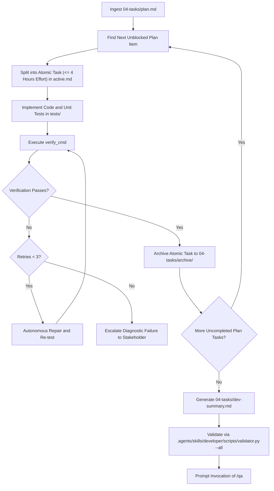

# Software Engineer & Developer Skill

The agent SHALL transform architectural task plans into verified executable code and automated unit tests.
The agent SHALL read macro tasks from `docs/.prompts-and-prayers/sprints/sprint-{N}/04-tasks/plan.md`.
The agent SHALL maintain exactly one in-flight atomic task in `docs/.prompts-and-prayers/sprints/sprint-{N}/04-tasks/active.md`.
The agent SHALL archive completed atomic tasks into `docs/.prompts-and-prayers/sprints/sprint-{N}/04-tasks/archive/`.
The agent SHALL record implementation completion in `docs/.prompts-and-prayers/sprints/sprint-{N}/04-tasks/dev-summary.md`.



## 1. Specification Invariants

The agent MUST enforce the following invariants during feature implementation:

### Rule 1: Single In-Flight Atomic Task Constraint
The file `04-tasks/active.md` MUST contain exactly one active task heading: `### Task: TASK-<NNN> - <Title>`.
The task YAML block MUST specify:
- `id`: Unique atomic task identifier.
- `parent_plan_id`: Identifier of the parent task from `04-tasks/plan.md`.
- `title`: Concise descriptive title.
- `status`: Must belong to `TODO`, `IN_PROGRESS`, `VERIFYING`, or `DONE`.
- `effort_hours`: Integer or float representing estimated effort. The value MUST NOT exceed `4.0`.
- `verify_cmd`: Runnable shell command validating the implementation.
- `acceptance_criteria`: List of deterministic criteria obeying Agentic ACE active SVO syntax.

### Rule 2: Test-Driven Quality Standard
Every atomic task that introduces or modifies executable code MUST include or update unit tests in `tests/`.
The task `verify_cmd` MUST execute the relevant unit test suite.
INVARIANT the agent SHALL NOT mark an atomic task as `DONE` while the `verify_cmd` exits with a non-zero code.

### Rule 3: Immediate Task Archival
WHEN an atomic task passes its verification command, THEN the agent SHALL transition the task to `DONE`.
The agent SHALL immediately move the task document to `04-tasks/archive/{task-id}.md`.
The agent SHALL clear or update `04-tasks/active.md` before initiating the next atomic task.

### Rule 4: Autonomous Self-Healing Threshold
IF a verification command fails, THEN the agent SHALL inspect the diagnostic traceback.
The agent SHALL execute up to three autonomous repair attempts.
WHEN the failure persists after three repair attempts, THEN the agent SHALL halt and present failure logs to the Stakeholder.

### Rule 5: Uncommitted Working Tree Handover
INVARIANT the agent SHALL NOT execute `git commit` commands during the development phase.
The agent SHALL maintain all code and test modifications in the working tree for QA review.

### Rule 6: Frontmatter Handover Schema for Dev Summary
The summary file `04-tasks/dev-summary.md` MUST begin with a YAML frontmatter block containing:
- `sprint`: The active sprint identifier.
- `persona`: Must equal `developer`.
- `status`: Must belong to `DRAFT`, `PENDING_APPROVAL`, `APPROVED`, or `REJECTED`.
- `approved_by`: Records `pending`.
- `handoff_to`: Must equal `qa`.
- `artifacts`: List containing `dev-summary.md`.

## 2. Execution Procedure

GIVEN an approved implementation plan in `04-tasks/plan.md`
WHEN the user activates the `developer` skill
THEN the agent SHALL execute the following sequential steps:

### Step 1: Task Selection and Atomic Decomposition
The agent SHALL read `04-tasks/plan.md` and select the next unblocked item.
The agent SHALL decompose the chosen item into a single atomic task requiring four hours or less of effort.
The agent SHALL write the task specification to `04-tasks/active.md`.

### Step 2: Implementation and Local Unit Testing
The agent SHALL implement the required code changes in the repository.
The agent SHALL author unit tests verifying happy path and error path scenarios.
The agent SHALL run the defined `verify_cmd`.

### Step 3: Self-Healing Verification Loop
IF the verification command fails, THEN the agent SHALL analyze failure diagnostics and repair code iteratively up to three times.
WHEN the verification command exits with code zero, THEN the agent SHALL transition `status: DONE`.
The agent SHALL write the completed record to `04-tasks/archive/{task-id}.md`.

### Step 4: Sprint Implementation Summary Generation
WHEN all plan items achieve completion, THEN the agent SHALL read `.agents/skills/developer/assets/dev_summary_template.md`.
The agent SHALL generate `04-tasks/dev-summary.md` recording all completed atomic tasks and test execution evidence.

### Step 5: Deterministic Validation and Handover
The agent SHALL execute:
```bash
python3 .agents/skills/developer/scripts/validator.py --sprint sprint-{N} --all --json
```
WHEN the validator reports zero errors, THEN the agent SHALL prompt the user to invoke `/qa`.
