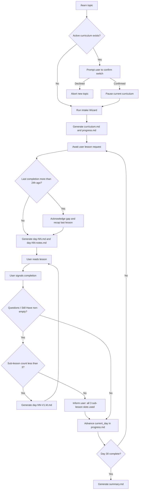

# Learn: 30-Day Personalized Curriculum Skill

The agent SHALL generate and deliver personalized 30-day learning curricula on any topic.
The agent SHALL track user progress using `docs/learn/<slug>/progress.md`.
The agent SHALL anchor all lesson generation to `.agents/skills/learn/assets/lesson.md`.
INVARIANT the agent SHALL NOT restrict topics to any single domain.



## 1. Invocation

### Procedure A: Start or Switch Curriculum

GIVEN the user invokes `/learn <topic>`.
WHEN the agent receives the invocation:
1. The agent SHALL scan `docs/learn/` for a `progress.md` file with `status: active`.
2. IF an active curriculum exists, THEN the agent SHALL execute Procedure B.
3. IF no active curriculum exists, THEN the agent SHALL execute Procedure C.

### Procedure B: Curriculum Switch Check

GIVEN an active curriculum exists in `docs/learn/`.
WHEN the user invokes `/learn <new topic>`:
1. The agent SHALL display the active curriculum name and its `current_day` value.
2. The agent SHALL ask the user to confirm the switch.
3. IF the user confirms, THEN the agent SHALL write `status: paused` to the active `progress.md`.
4. The agent SHALL then execute Procedure C for the new topic.
5. IF the user declines, THEN the agent SHALL abort the new topic intake.
INVARIANT the agent SHALL NOT delete or overwrite any existing curriculum directory.

### Procedure C: Intake Wizard

WHEN the agent starts the intake wizard:
1. The agent SHALL ask the user for the following four fields:
   - Topic (free text)
   - Current level (one of: beginner, intermediate, advanced)
   - Daily time budget in minutes
   - Primary goal (free text)
2. The agent SHALL derive the slug by converting the topic string to lowercase kebab-case.
INVARIANT the agent SHALL NOT proceed to curriculum generation until the user supplies all four fields.

## 2. Curriculum Generation

### Procedure D: Generate Curriculum and Progress Files

GIVEN the user supplies all four intake fields.
WHEN intake completes:
1. The agent SHALL create the directory `docs/learn/<slug>/`.
2. The agent SHALL copy `.agents/skills/learn/assets/lesson.css` into `docs/learn/<slug>/lesson.css`.
3. The agent SHALL generate `docs/learn/<slug>/curriculum.md`.
4. `curriculum.md` SHALL list 30 rows. Each row SHALL contain a day number, topic title, and one-sentence learning objective.
5. The agent SHALL generate `docs/learn/<slug>/progress.md` with this YAML frontmatter:

```yaml
---
curriculum: <slug>
status: active
current_day: 1
started_at: <ISO 8601 timestamp>
completed_days: []
---
```

6. The agent SHALL write a human-readable journal section below the YAML frontmatter in `progress.md`.
INVARIANT the agent SHALL NOT mark two curricula as `active` simultaneously.

## 3. Lesson Delivery

### Procedure E: Deliver a Lesson

GIVEN the user requests their next lesson or a specific day in plain English.
WHEN the agent receives the lesson request:
1. The agent SHALL read `progress.md` to determine `current_day`.
2. The agent SHALL check the `completed_at` timestamp of the last entry in `completed_days`.
3. IF the last `completed_at` timestamp is more than 24 hours before the current time, THEN the agent SHALL execute Procedure F before generating the lesson.
4. IF `docs/learn/<slug>/lesson.css` does not exist, THEN the agent SHALL copy `.agents/skills/learn/assets/lesson.css` into `docs/learn/<slug>/lesson.css`.
5. The agent SHALL generate `docs/learn/<slug>/day-NN.html` using `.agents/skills/learn/assets/lesson.md` as the HTML template.
6. The filename SHALL use zero-padded two-digit day numbers (e.g., `day-01.html`, `day-12.html`).
7. The agent SHALL also create `docs/learn/<slug>/day-NN-notes.md` using `.agents/skills/learn/assets/notes.md`.
8. The agent SHALL execute Procedure M on `day-NN.html` to apply the readability pass.
INVARIANT the agent SHALL NOT pre-generate lesson files the user has not yet requested.
INVARIANT the agent SHALL NOT overwrite an existing `day-NN-notes.md`.

### Procedure F: Gap Handling

GIVEN the last `completed_at` timestamp is more than 24 hours before the current time.
WHEN the agent detects a gap:
1. The agent SHALL compute the elapsed day count since the last completed lesson.
2. The agent SHALL display that elapsed day count to the user.
3. The agent SHALL extract the Day N objective and key takeaway from `curriculum.md`.
4. The agent SHALL display a brief recap of Day N to the user.
5. The agent SHALL then proceed to lesson delivery.
INVARIANT the agent SHALL NOT block lesson access due to gaps.

## 4. Completion Signal Handling

### Procedure G: Process Completion Signal

GIVEN the user says "done", "mark day complete", or an equivalent phrase.
WHEN the agent receives the completion signal:
1. The agent SHALL read `docs/learn/<slug>/day-NN-notes.md`.
2. The agent SHALL extract the content under the `## Questions I Still Have` heading.
3. IF that section contains non-empty content, THEN the agent SHALL execute Procedure H.
4. IF that section is empty, THEN the agent SHALL execute Procedure I.
INVARIANT the agent SHALL NOT inspect `## My Notes` or `## Key Insight` as completion triggers.
INVARIANT the agent SHALL NOT advance `current_day` without an explicit completion signal.

### Procedure H: Sub-Lesson Generation and Chaining

GIVEN the `## Questions I Still Have` section contains non-empty content.
WHEN the agent evaluates sub-lesson eligibility:
1. The agent SHALL count files matching the pattern `day-NN-V1.*.html` in the curriculum directory.
2. IF the count is less than 3, THEN:
   a. The agent SHALL set M to the count incremented by 1.
   b. The agent SHALL generate `docs/learn/<slug>/day-NN-V1.M.html` addressing the open questions.
   c. The agent SHALL execute Procedure M on `day-NN-V1.M.html` to apply the readability pass.
   d. The agent SHALL instruct the user to clear `## Questions I Still Have` in `day-NN-notes.md` after reviewing the sub-lesson.
3. IF the count equals 3, THEN:
   a. The agent SHALL inform the user that the curriculum used all 3 sub-lesson slots.
   b. The agent SHALL recommend external resources for the remaining questions.
   c. The agent SHALL execute Procedure I.
INVARIANT the agent SHALL NOT generate a file named `day-NN-V1.4.html` or beyond.

The sub-lesson chaining sequence SHALL operate as follows:
- Day N completion signal triggers a check of `day-NN-notes.md`.
- IF open questions exist, THEN the agent generates `day-NN-V1.1.html`.
- `day-NN-V1.1.html` completion triggers a re-read of `day-NN-notes.md`.
- IF open questions remain, THEN the agent generates `day-NN-V1.2.html`.
- `day-NN-V1.2.html` completion triggers a re-read of `day-NN-notes.md`.
- IF open questions remain, THEN the agent generates `day-NN-V1.3.html`.
- After `day-NN-V1.3.html` completion, the agent SHALL NOT generate further sub-lessons.

### Procedure I: Advance Day

GIVEN the `## Questions I Still Have` section is empty or the sub-lesson count equals 3.
WHEN the agent advances the curriculum:
1. The agent SHALL append the following entry to `completed_days` in `progress.md`:
   ```yaml
   - day: <N>
     completed_at: <ISO 8601 timestamp>
   ```
2. The agent SHALL increment `current_day` by 1 in `progress.md`.
3. IF `current_day` was 30 before the increment, THEN the agent SHALL set `status: completed` in `progress.md`.
4. IF `current_day` was 30, THEN the agent SHALL execute Procedure J.

## 5. Day 30 Completion Ceremony

### Procedure J: Generate Summary Artifact

GIVEN the user marks Day 30 complete.
WHEN the agent detects Day 30 completion:
1. The agent SHALL generate `docs/learn/<slug>/summary.md` without prompting the user.
2. The agent SHALL follow the structure in `.agents/skills/learn/assets/summary.md`.
3. `summary.md` SHALL contain the following sections:
   a. A day-by-day table with columns: Day, Objective, Key Takeaway (30 rows).
   b. A prose "What You Learned" paragraph synthesising the full 30-day arc.
   c. A "What to Learn Next" section containing 3 to 5 topic suggestions.
4. Each suggestion SHALL include the topic name and a one-sentence rationale.
5. Each rationale SHALL reference adjacency to the completed topic and relevance to the user's `goal` field.
6. The agent SHALL derive suggestions using both topic adjacency and the `goal` field from `progress.md`.
7. The agent SHALL execute Procedure M on `summary.md` to apply the readability pass.

## 6. Resume Flow

### Procedure K: Resume a Paused Curriculum

GIVEN the user expresses intent to resume a paused curriculum in plain English.
WHEN the agent detects resume intent:
1. The agent SHALL scan `docs/learn/` for `progress.md` files with `status: paused`.
2. The agent SHALL match the user's stated topic to a paused curriculum slug.
3. IF the agent finds a match, THEN the agent SHALL write `status: active` to that `progress.md`.
4. IF the agent finds no match, THEN the agent SHALL list all paused curricula and ask the user to select one.
INVARIANT the agent SHALL NOT start a new intake wizard for a resume action.

## 7. Lesson Regeneration

### Procedure L: Regenerate a Lesson

GIVEN the user signals dissatisfaction with a lesson.
WHEN the agent receives the regeneration request:
1. The agent SHALL count files matching the pattern `day-NN-v*.html` in the curriculum directory.
2. IF the count equals 3, THEN the agent SHALL inform the user that the regeneration cap applies.
3. IF the count equals 3, THEN the agent SHALL recommend manual editing or external resources.
4. IF the count is less than 3, THEN:
   a. The agent SHALL ask the user to identify the issue from these options: below my level, above my level, too long, wrong focus, other.
   b. The user SHALL select or describe the issue before the agent regenerates.
   c. The agent SHALL rename `day-NN.html` to `day-NN-v<K>.html` where K is the next backup index.
   d. The agent SHALL generate a new `day-NN.html` tailored to the user's stated issue.
   e. The agent SHALL execute Procedure M on the new `day-NN.html` to apply the readability pass.
INVARIANT the agent SHALL NOT delete any backup lesson file.

## 8. Lesson File Structure

The agent SHALL generate every lesson file to match the structure in `.agents/skills/learn/assets/lesson.md`.
The agent SHALL anchor all generated lesson content to `.agents/skills/learn/references/day-01-sample.html`.
The agent SHALL scale content depth to match the `level` and `time_budget` fields from intake.

Each lesson file SHALL be a valid HTML document with the extension `.html`.
Each lesson file SHALL contain the following sections in order:
1. Learning objectives (unordered list)
2. Concept explanation (prose paragraphs, with code blocks inside `<pre><code>` elements)
3. Real-world examples (2 to 3 examples)
4. Comprehension questions (3 to 5 items, each followed by a `<details>` collapsible answer block)
5. Practical tasks (one core task scoped to 15 to 30 minutes, one stretch task scoped to 45 to 90 minutes)
6. Further reading (named resources and search terms, no live URLs)

INVARIANT the agent SHALL NOT embed live URLs in lesson files.
INVARIANT the agent SHALL NOT include more than 2 practical tasks per lesson.


## 9. Readability Pass

### Procedure M: Apply Write Skill

GIVEN the agent generates a lesson or summary file.
WHEN the agent finalizes the file:
1. The agent SHALL apply the `write` skill to rephrase prose into Plain English.
2. The agent SHALL identify each block of content by its type before rephrasing.
3. For each block, the agent SHALL apply these rules:
   - Prose paragraphs and bullet lists: rephrase into Plain English (Flesch score >= 65).
   - `<details>` answer blocks: rephrase the prose answer text inside them.
   - `<pre><code>` blocks: do NOT rephrase; preserve verbatim.
   - HTML attributes, tag names, and structural markup: do NOT rephrase; preserve verbatim.
   - Tables: rephrase prose content in cells; do NOT alter column structure or data values.
4. The agent SHALL strip all HTML tags from the file content to extract plain prose text.
5. The agent SHALL validate the extracted prose using the `write` skill validator:
   ```bash
   python3 .agents/skills/write/scripts/validator.py <file_path> --json
   ```
6. The agent SHALL check the Flesch Reading Ease score and prose violation count from the output.
7. IF the score is below 65 or violations exist, THEN the agent SHALL rephrase prose blocks and re-validate.
8. The agent SHALL iterate steps 5 to 7 until the score meets or exceeds 65 and violations equal 0.
9. The agent SHALL re-embed the validated prose back into the HTML structure.
10. The agent SHALL overwrite the target file with the final HTML version.
INVARIANT the agent SHALL NOT alter executable code, commands, data structures, or syntax inside `<pre><code>` blocks.
INVARIANT the agent SHALL NOT apply Procedure M to `day-NN-notes.md` or `progress.md`.

## 10. Global Invariants

INVARIANT the agent SHALL NOT generate curriculum content before completing the intake wizard.
INVARIANT the agent SHALL NOT advance `current_day` beyond 30.
INVARIANT the agent SHALL NOT compute or display streak counts.
INVARIANT the agent SHALL NOT implement any export command or mechanism.
INVARIANT the agent SHALL NOT convert `day-NN-notes.md` files to HTML; notes files SHALL remain in `.md` format.
