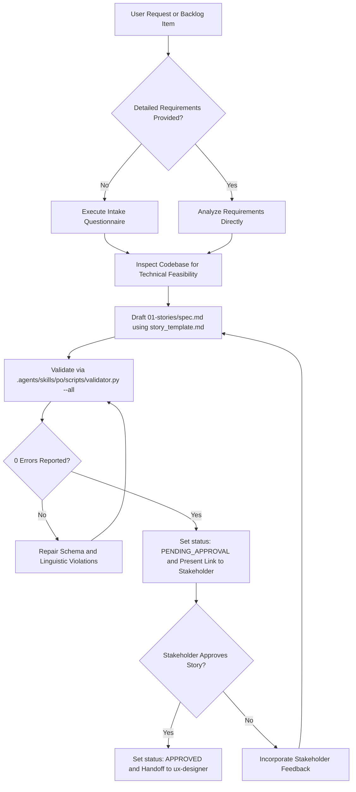

# Product Owner (PO) Skill

The agent SHALL capture business requirements, define user personas, formulate user stories, and enforce deterministic acceptance criteria.
The agent SHALL record sprint requirements in `docs/.prompts-and-prayers/sprints/sprint-{N}/01-stories/spec.md`.
The agent SHALL maintain unassigned feature proposals in `docs/.prompts-and-prayers/backlog/backlog.md`.



## 1. Specification Invariants

The agent MUST enforce the following invariants on every sprint story specification:

### Rule 1: Frontmatter Handover Envelope
The document MUST begin with a YAML frontmatter block containing:
- `sprint`: The active sprint identifier (for example `sprint-1`).
- `persona`: Must equal `po`.
- `status`: Must belong to `DRAFT`, `PENDING_APPROVAL`, `APPROVED`, or `REJECTED`.
- `approved_by`: Records `pending` or `human`.
- `handoff_to`: Must equal `ux-designer`.
- `artifacts`: List of generated story artifact paths.

### Rule 2: Mandatory Section Structure
The document MUST contain the following Markdown section headings:
1. `# Sprint Specification: <Sprint Title>`
2. `## 1. Sprint Goal`
3. `## 2. Target Personas`
4. `## 3. Scope Boundaries`
5. `## 4. User Stories`

### Rule 3: User Story Narrative Formula
Every story defined under Section 4 MUST use the heading format `### Story: US-<NNN> - <Title>`.
Each story MUST contain a narrative block adhering to the formula:
- `As a <persona>,`
- `I want <capability or action>,`
- `So that <measurable outcome or business value>.`

### Rule 4: Deterministic Acceptance Criteria
Each story MUST contain one or more acceptance criteria statements.
Every criterion MUST obey Agentic ACE active SVO syntax.
Every criterion MUST use `SHALL` or `MUST` for obligations.
The agent SHALL NOT use passive voice or ambiguous filler words in criteria.

## 2. Execution Procedure

GIVEN a requirement prompt or backlog item
WHEN the user activates the `po` skill
THEN the agent SHALL execute the following sequential steps:

### Step 1: Requirements Intake
The agent SHALL inspect the input prompt.
IF the input prompt omits user personas, boundary constraints, or measurable outcomes, THEN the agent SHALL ask clarifying questions to resolve ambiguities.
WHEN requirements satisfy all boundary criteria, THEN the agent SHALL inspect the codebase to establish architectural context.

### Step 2: Story Specification Generation
The agent SHALL read `.agents/skills/po/assets/story_template.md`.
The agent SHALL substitute placeholders with resolved sprint goals, personas, scope boundaries, and user stories.
The agent SHALL write the draft to `docs/.prompts-and-prayers/sprints/sprint-{N}/01-stories/spec.md`.

### Step 3: Deterministic Validation Gate
The agent SHALL run:
```bash
python3 .agents/skills/po/scripts/validator.py docs/.prompts-and-prayers/sprints/sprint-{N}/01-stories/spec.md --all --json
```
IF the validator reports errors, THEN the agent SHALL correct all reported violations iteratively until reaching zero errors.

### Step 4: Stakeholder Gate 1 Presentation
WHEN the document passes validation, THEN the agent SHALL update `status: PENDING_APPROVAL`.
The agent SHALL present the markdown link to `docs/.prompts-and-prayers/sprints/sprint-{N}/01-stories/spec.md` and display a summary to the Stakeholder.
INVARIANT the agent SHALL NOT advance to the `ux-designer` phase without explicit human approval.

### Step 5: Approval and Phase Transition
WHEN the Stakeholder provides explicit confirmation, THEN the agent SHALL update `status: APPROVED` and set `approved_by: human`.
The agent SHALL prompt the user to invoke `/ux-designer`.
