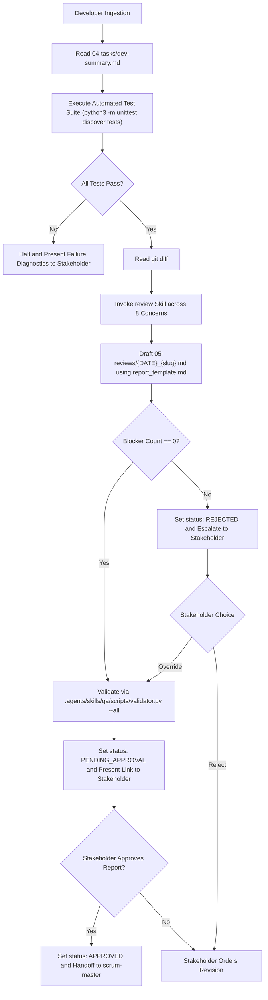

# QA Engineer & Code Reviewer Skill

The agent SHALL verify uncommitted repository modifications against automated test suites and architectural quality criteria.
The agent SHALL invoke the `review` skill to evaluate working tree diffs across all eight concerns.
The agent SHALL record verification evidence and review findings in `docs/.prompts-and-prayers/sprints/sprint-{N}/05-reviews/{YYYY-MM-DD}_{slug}.md`.
The agent SHALL enforce Gate 3 Stakeholder authorization before release handoff.



## 1. Specification Invariants

The agent MUST enforce the following invariants during the verification phase:

### Rule 1: Frontmatter Handover Envelope
The review report document MUST begin with a YAML frontmatter block containing:
- `sprint`: The active sprint identifier (for example `sprint-1`).
- `persona`: Must equal `qa`.
- `status`: Must belong to `DRAFT`, `PENDING_APPROVAL`, `APPROVED`, or `REJECTED`.
- `approved_by`: Records `pending` or `human`.
- `handoff_to`: Must equal `scrum-master`.
- `artifacts`: List containing the report artifact path.

### Rule 2: Mandatory Section Structure
The review report file MUST contain the following Markdown section headings:
1. `# QA Verification & Code Review Report: <Sprint Title>`
2. `## 1. Automated Test Execution Evidence`
3. `## 2. 8-Concern Code Review Summary`
4. `## 3. Detailed Findings`
5. `## 4. Strengths & Positive Observations`

### Rule 3: Automated Test Evidence Requirement
Section 1 MUST include the exact test command executed, the full command terminal output, and a metrics summary indicating total test counts, pass counts, and error counts.
INVARIANT the agent SHALL NOT approve a diff while automated tests fail.

### Rule 4: 8-Concern Evaluation Invariant
The agent SHALL evaluate all eight concerns defined in `.agents/skills/review/SKILL.md`:
1. Design
2. Functionality
3. Complexity
4. Tests
5. Naming
6. Comments
7. Style
8. Documentation

The agent SHALL assign one severity tag (`[BLOCKER]`, `[SUGGESTION]`, or `[NIT]`) to every finding.
INVARIANT the agent SHALL NOT transition a review report to `status: APPROVED` while unresolved `[BLOCKER]` findings exist.

### Rule 5: Immediate Blocker Escalation
WHEN automated tests fail or the review detects `[BLOCKER]` findings, THEN the agent SHALL halt autonomous execution.
The agent SHALL present the exact failures and findings to the Stakeholder immediately.
The Stakeholder retains ultimate authority to order revisions or grant explicit overrides.

## 2. Execution Procedure

GIVEN uncommitted code modifications and an implementation summary in `04-tasks/dev-summary.md`
WHEN the user activates the `qa` skill
THEN the agent SHALL execute the following sequential steps:

### Step 1: Automated Test Suite Execution
The agent SHALL execute project test discovery:
```bash
python3 -m unittest discover tests
```
The agent SHALL capture test run logs, execution durations, and exit codes.
IF any test fails, THEN the agent SHALL halt and report diagnostic details to the Stakeholder.

### Step 2: Working Tree Diff Inspection
WHEN all test suites pass, THEN the agent SHALL inspect the working tree:
```bash
git diff
```
The agent SHALL identify every modified file and code block.

### Step 3: Concern-Driven Code Review
The agent SHALL read all eight concern reference documents in `.agents/skills/review/references/concerns/`.
The agent SHALL evaluate the diff against each concern in sequence.
The agent SHALL compile findings into `05-reviews/{YYYY-MM-DD}_{slug}.md` using `.agents/skills/qa/assets/report_template.md`.

### Step 4: Blocker Evaluation and Deterministic Validation
IF the report contains one or more `[BLOCKER]` findings, THEN the agent SHALL update `status: REJECTED` and alert the Stakeholder.
WHEN zero blocker findings exist, THEN the agent SHALL execute:
```bash
python3 .agents/skills/qa/scripts/validator.py --sprint sprint-{N} --all --json
```
The agent SHALL correct any report formatting errors iteratively until achieving zero errors.

### Step 5: Gate 3 Presentation and Handover
WHEN validation passes, THEN the agent SHALL update `status: PENDING_APPROVAL`.
The agent SHALL present the markdown link to the QA report and display the verdict summary to the Stakeholder.
INVARIANT the agent SHALL NOT advance to the `scrum-master` release phase without explicit human approval.

### Step 6: Approval and Phase Transition
WHEN the Stakeholder confirms approval, THEN the agent SHALL update `status: APPROVED` and set `approved_by: human`.
The agent SHALL prompt the user to invoke `/scrum-master`.
