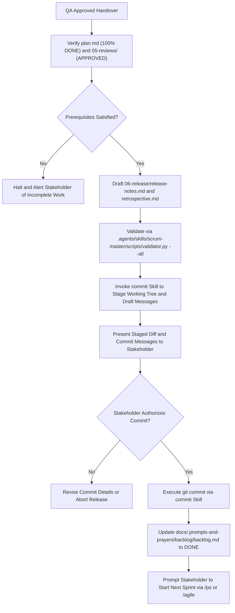

# Scrum Master & Delivery Manager Skill

The agent SHALL coordinate sprint release procedures, verify sprint completion gates, author release notes and retrospectives, and orchestrate atomic Conventional Commits.
The agent SHALL record sprint release notes in `docs/.prompts-and-prayers/sprints/sprint-{N}/06-release/release-notes.md`.
The agent SHALL record retrospectives in `docs/.prompts-and-prayers/sprints/sprint-{N}/06-release/retrospective.md`.
The agent SHALL update the product backlog ledger in `docs/.prompts-and-prayers/backlog/backlog.md`.
The agent SHALL invoke the `commit` skill to prepare Conventional Commits.



## 1. Specification Invariants

The agent MUST enforce the following invariants during the sprint release phase:

### Rule 1: Multi-Stage Closure Verification
INVARIANT the agent SHALL NOT initiate release staging until all prerequisite conditions pass:
1. Every task in `04-tasks/plan.md` has reached `status: DONE`.
2. The QA review report in `05-reviews/` exists with `status: APPROVED` and zero `[BLOCKER]` findings.
3. The project test command `python3 -m unittest discover tests` exits with code zero.

### Rule 2: Dual Release Artifact Requirement
The agent SHALL produce both `06-release/release-notes.md` and `06-release/retrospective.md`.
The document `release-notes.md` MUST begin with a YAML frontmatter block containing:
- `sprint`: The active sprint identifier.
- `persona`: Must equal `scrum-master`.
- `status`: Must belong to `DRAFT`, `PENDING_APPROVAL`, `APPROVED`, or `REJECTED`.
- `approved_by`: Records `pending` or `human`.
- `handoff_to`: Must equal `po`.
- `artifacts`: List of generated release artifact paths.

### Rule 3: Mandatory Gate 4 Human Confirmation
The agent SHALL invoke the `commit` skill to analyze unstaged changes, split multi-concern modifications, and generate Conventional Commit 1.0.0 messages.
INVARIANT the agent MUST obtain explicit human confirmation before executing any `git commit` command.

### Rule 4: Backlog Synchronization
WHEN the human confirms git commit execution, THEN the agent SHALL update the product backlog in `docs/.prompts-and-prayers/backlog/backlog.md`.
The agent SHALL transition the active sprint backlog entry to `status: DONE`.

## 2. Execution Procedure

GIVEN an approved QA review report and completed implementation
WHEN the user activates the `scrum-master` skill
THEN the agent SHALL execute the following sequential steps:

### Step 1: Pre-Release Integrity Audit
The agent SHALL inspect `04-tasks/plan.md` to verify all task statuses equal `DONE`.
The agent SHALL inspect `05-reviews/` to verify that the latest review report status equals `APPROVED`.
The agent SHALL run `python3 -m unittest discover tests` to verify zero test regressions.

### Step 2: Release Documentation Generation
The agent SHALL read `.agents/skills/scrum-master/assets/release_notes_template.md`.
The agent SHALL author `06-release/release-notes.md` summarizing delivered user stories and commit proposals.
The agent SHALL read `.agents/skills/scrum-master/assets/retrospective_template.md`.
The agent SHALL author `06-release/retrospective.md` capturing sprint metrics and process improvement actions.

### Step 3: Deterministic Release Validation
The agent SHALL execute:
```bash
python3 .agents/skills/scrum-master/scripts/validator.py --sprint sprint-{N} --all --json
```
The agent SHALL correct any structural or metadata errors iteratively until achieving zero errors.

### Step 4: Gate 4 Commit Presentation
The agent SHALL activate the `commit` skill to stage target files and generate Conventional Commit headers and bodies.
The agent SHALL present the staged file diff and formatted commit message to the Stakeholder.
INVARIANT the agent SHALL NOT execute `git commit` until the Stakeholder explicitly confirms authorization.

### Step 5: Commit Execution and Sprint Closure
WHEN the Stakeholder provides authorization, THEN the agent SHALL execute `git commit`.
The agent SHALL update the sprint status in `docs/.prompts-and-prayers/backlog/backlog.md` to `DONE`.
The agent SHALL display a completion summary and prompt the user to start the subsequent sprint.
