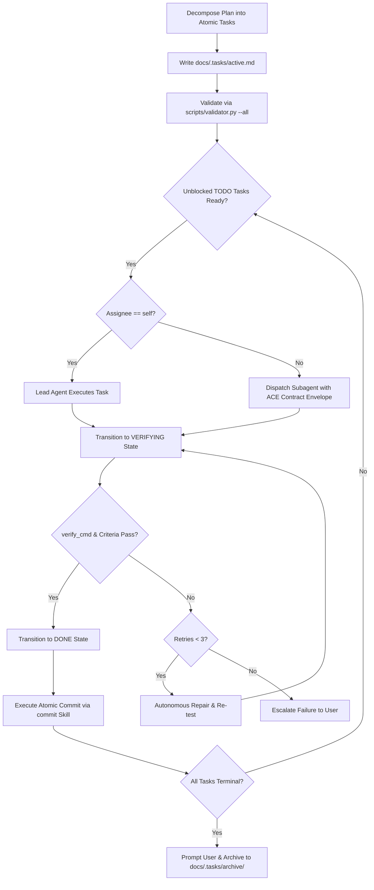

# Task: Deterministic Task Graph & Subagent Orchestration Skill

The agent SHALL structure workflows into directed acyclic task graphs, manage execution states, and verify acceptance criteria.
The agent SHALL record active task states in `docs/.tasks/active.md`.
The agent SHALL archive completed task graphs to `docs/.tasks/archive/`.



## 1. Task Specification & Schema Invariants

Every task defined in `docs/.tasks/active.md` MUST strictly satisfy these invariants:

### Rule 1: Section Heading and Embedded YAML Block Structure
Each task MUST start with a Markdown section heading: `### Task: <ID> - <Title>`.
The task heading MUST contain an immediate fenced YAML metadata block.
The YAML block MUST define all mandatory fields: `id`, `title`, `status`, `assignee`, `depends_on`, `acceptance_criteria`.

### Rule 2: Permitted Lifecycle State Enumerations
The `status` field MUST belong to the permitted enumeration set:
`TODO`, `IN_PROGRESS`, `VERIFYING`, `DONE`, `ABORTED`.
The agent SHALL NOT transition a task to `IN_PROGRESS` until all prerequisite tasks in `depends_on` reach `DONE`.
The agent SHALL NOT transition a task to `DONE` without satisfying all verification gates.
IF a task transitions to `ABORTED`, THEN the YAML block MUST include an `abort_reason` field.

### Rule 3: Strict Graph Acyclicity
The task dependency graph MUST NOT contain cyclic references.
Every identifier listed in `depends_on` MUST exist within the same task document.
A task MUST NOT declare a dependency on itself.

### Rule 4: Deterministic Acceptance Criteria
The `acceptance_criteria` list MUST contain one or more concrete conditions.
Every criterion string MUST adhere to Agentic ACE active SVO syntax.
IF the task alters executable code, THEN the YAML block MUST include a runnable `verify_cmd` string.

## 2. Subagent Contract Delegation

WHEN a task specifies an assignee other than `self`:
1. The lead agent SHALL construct an Agentic ACE contract envelope.
2. The contract envelope MUST specify: Task ID, Scope, Input Artifacts, Acceptance Criteria, and Verification Command.
3. The lead agent SHALL dispatch the task using `invoke_subagent`.
4. The lead agent SHALL wait for the subagent deliverable.
5. The lead agent SHALL verify the deliverable against the task acceptance criteria.

## 3. Operational Procedures

### Procedure A: Plan Decomposition and Task Graph Creation
GIVEN a user request or architecture plan.
WHEN the agent initiates execution:
1. The agent SHALL decompose the work into atomic, verifiable tasks.
2. The agent SHALL write the task graph to `docs/.tasks/active.md`.
3. The agent SHALL execute `python3 .agents/skills/task/scripts/validator.py --all --json`.
4. IF the validator returns errors, THEN the agent SHALL correct the task schema until zero errors remain.

### Procedure B: Task Dispatch and Concurrency Execution
WHEN unblocked tasks exist in `docs/.tasks/active.md`:
1. The agent SHALL query ready tasks using `python3 .agents/skills/task/scripts/validator.py --status`.
2. The agent SHALL transition ready tasks to `IN_PROGRESS`.
3. IF multiple independent unblocked tasks exist, THEN the agent SHALL dispatch subagents concurrently.
4. The agent SHALL update `docs/.tasks/active.md` as task states change.

### Procedure C: Verification and Autonomous Repair Loop
WHEN implementation work for a task completes:
1. The agent SHALL transition the task to `VERIFYING`.
2. IF `verify_cmd` is present, THEN the agent SHALL execute the command.
3. IF the verification command exits with non-zero code, THEN the agent SHALL initiate an autonomous repair attempt.
4. The agent SHALL execute up to 3 repair attempts.
5. IF all 3 repair attempts fail, THEN the agent SHALL request user intervention.
6. WHEN verification checks pass with exit code 0, THEN the agent SHALL transition the task to `DONE`.

### Procedure D: Atomic Commit Integration
GIVEN a task that transitions to `DONE`.
WHEN code modifications exist in the working tree:
1. The agent SHALL invoke the `commit` skill.
2. The agent SHALL draft the commit message following the `commit` skill without referencing local task IDs.
3. The agent SHALL present the staged diff and commit draft for user confirmation.

### Procedure E: Interactive Completion and Archiving
GIVEN all tasks in `docs/.tasks/active.md` reach `DONE` or `ABORTED`.
WHEN the execution graph terminates:
1. The agent SHALL run final validation: `python3 .agents/skills/task/scripts/validator.py --all --json`.
2. The agent SHALL display a completion summary to the user.
3. The agent SHALL prompt the user for archive confirmation.
4. WHEN the user confirms archiving, THEN the agent SHALL move the file to `docs/.tasks/archive/{YYYY-MM-DD}_{slug}.md`.
5. The agent SHALL initialize a clean `docs/.tasks/active.md`.

## 4. Reference Examples

### Example 1: Active Task Section
```markdown
### Task: TASK-001 - Implement Token Refresh Route

```yaml
id: TASK-001
title: Implement Token Refresh Route
status: DONE
assignee: self
depends_on: []
verify_cmd: "python3 -m unittest tests/test_auth.py"
acceptance_criteria:
  - The endpoint SHALL accept valid refresh tokens.
  - The endpoint SHALL return a fresh JWT token payload.
  - The server SHALL reject expired refresh tokens.
```

The agent implemented the POST /auth/refresh endpoint in auth/routes.py.
All unit tests passed with exit code 0.
```

### Example 2: Subagent Contract Envelope
```text
GIVEN the repository contains the auth module in auth/routes.py.
WHEN executing TASK-002: Add Token Rotation Tests.
THEN the subagent SHALL add test cases for token rotation.
INVARIANT the test suite MUST pass with exit code 0.
```

## 5. Verification Checklist

WHEN executing workflows with the `task` skill, THEN the agent SHALL verify:
1. `python3 .agents/skills/task/scripts/validator.py --all` returns exit code 0.
2. All task transitions respect prerequisite dependencies in `depends_on`.
3. Every task in `DONE` status passed its verification command and acceptance criteria.
4. The agent obtained user confirmation before moving completed tasks to archive.
