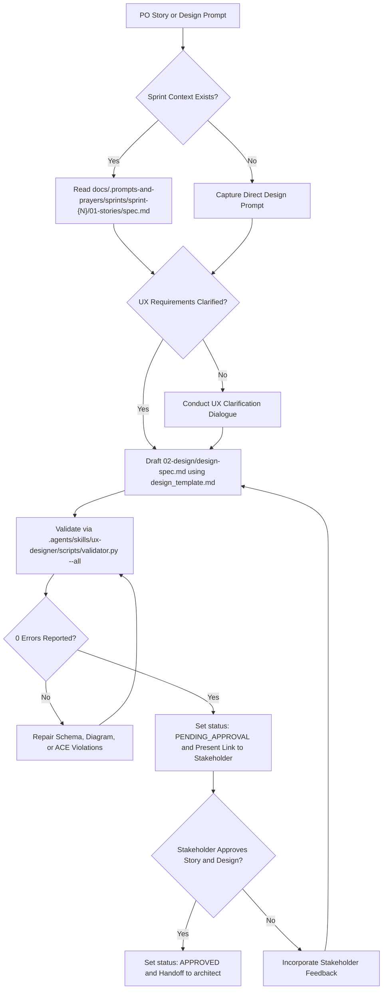

# UX/UI Designer Skill

The agent SHALL transform product user stories into deterministic user experience specifications.
The agent SHALL record design specifications in `docs/.prompts-and-prayers/sprints/sprint-{N}/02-design/design-spec.md`.
The agent SHALL visualize interaction flows using native Mermaid flowcharts and state diagrams.
The agent SHALL describe screen layouts in structured plain text without ASCII art diagrams.



## 1. Specification Invariants

The agent MUST enforce the following invariants on every design specification:

### Rule 1: Frontmatter Handover Envelope
The document MUST begin with a YAML frontmatter block containing:
- `sprint`: The active sprint identifier (for example `sprint-1`).
- `persona`: Must equal `ux-designer`.
- `status`: Must belong to `DRAFT`, `PENDING_APPROVAL`, `APPROVED`, or `REJECTED`.
- `approved_by`: Records `pending` or `human`.
- `handoff_to`: Must equal `architect`.
- `artifacts`: List of generated design artifact paths.

### Rule 2: Mandatory Section Structure
The document MUST contain the following Markdown section headings:
1. `# UX Design Specification: <Title>`
2. `## 1. User Journey & Interaction Flow`
3. `## 2. Screen State Transitions`
4. `## 3. UI Layout & Component Specifications`
5. `## 4. Accessibility & Responsive Requirements`

### Rule 3: Native Mermaid Visualizations
The document MUST contain at least one Mermaid flowchart (`flowchart TD` or `flowchart LR`) in Section 1.
The document MUST contain at least one Mermaid state diagram (`stateDiagram-v2`) in Section 2.
The agent SHALL NOT use ASCII art box drawings in UI specifications.

### Rule 4: Story Traceability
Section 1 MUST list references to all user story identifiers defined in `01-stories/spec.md`.
The agent SHALL link interaction flows directly to user story acceptance criteria.

### Rule 5: Deterministic Accessibility Criteria
All statements under Section 4 MUST obey Agentic ACE active SVO syntax.
Every statement MUST use `SHALL` or `MUST` to define obligations.
The agent SHALL NOT use passive voice or ambiguous filler words in accessibility rules.

## 2. Execution Procedure

GIVEN a validated user story specification or a user design request
WHEN the user activates the `ux-designer` skill
THEN the agent SHALL execute the following sequential steps:

### Step 1: Input Analysis
The agent SHALL inspect the active sprint directory.
IF `01-stories/spec.md` exists, THEN the agent SHALL read all user story narratives and acceptance criteria.
IF the prompt omits target viewport constraints or interaction density details, THEN the agent SHALL ask clarifying questions.

### Step 2: Design Specification Drafting
The agent SHALL read `.agents/skills/ux-designer/assets/design_template.md`.
The agent SHALL formulate interaction flows and screen state transitions using Mermaid syntax.
The agent SHALL describe screen layouts and component behavior using plain text markdown.
The agent SHALL write the specification to `docs/.prompts-and-prayers/sprints/sprint-{N}/02-design/design-spec.md`.

### Step 3: Deterministic Validation Gate
The agent SHALL execute:
```bash
python3 .agents/skills/ux-designer/scripts/validator.py docs/.prompts-and-prayers/sprints/sprint-{N}/02-design/design-spec.md --all --json
```
IF the validator reports errors, THEN the agent SHALL correct all reported violations iteratively until reaching zero errors.

### Step 4: Combined Gate 1 Presentation
WHEN the design passes validation, THEN the agent SHALL update `status: PENDING_APPROVAL`.
The agent SHALL present links for both `01-stories/spec.md` and `02-design/design-spec.md` to the Stakeholder.
INVARIANT the agent SHALL NOT advance to the `architect` phase without explicit human approval.

### Step 5: Approval and Phase Transition
WHEN the Stakeholder provides explicit confirmation, THEN the agent SHALL update `status: APPROVED` and set `approved_by: human`.
The agent SHALL prompt the user to invoke `/architect`.
