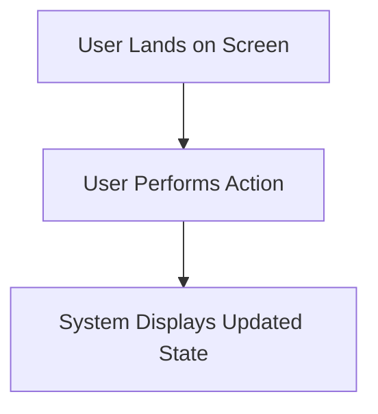
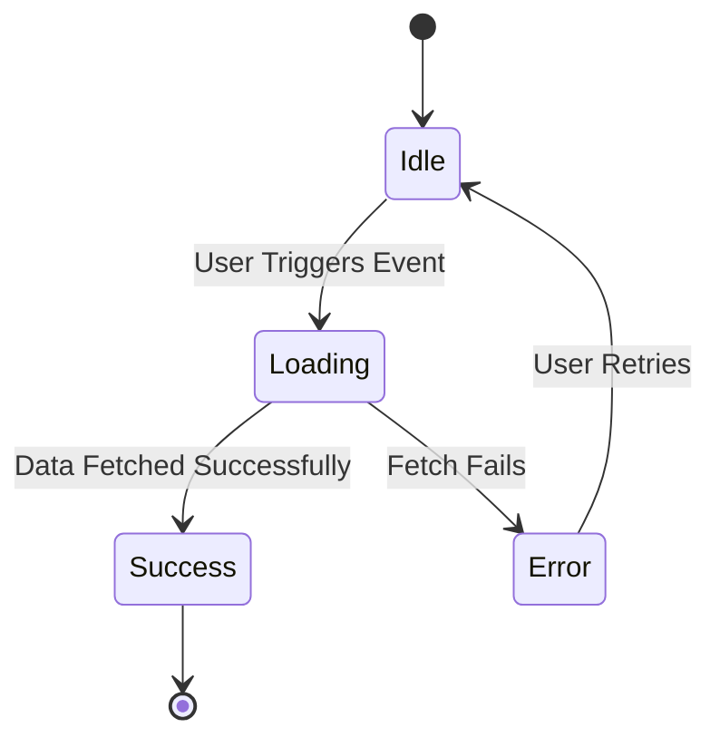

# UX Design Specification: {FEATURE_TITLE}

## 1. User Journey & Interaction Flow

### Overview
{High-level description of user goals, emotional arc, and primary interaction steps.}

### Traced Stories
- Ref: {US-001}

### Interaction Flowchart

## 2. Screen State Transitions

## 3. UI Layout & Component Specifications

### Layout Structure
- **Header**: {Plain text layout description of header elements and navigation}
- **Main Viewport**: {Plain text layout description of primary content and controls}
- **Action Controls**: {Plain text layout description of buttons, inputs, and feedback elements}

### Component Specifications
- **Component 1**: {Behavior, props, states, and event handlers}
- **Component 2**: {Behavior, props, states, and event handlers}

## 4. Accessibility & Responsive Requirements

- The interface SHALL support full keyboard navigation for all interactive controls.
- The interface SHALL provide explicit aria-label attributes on icon buttons.
- The layout SHALL adapt responsively across mobile, tablet, and desktop viewports.
- The system SHALL maintain a minimum color contrast ratio of 4.5 to 1.
