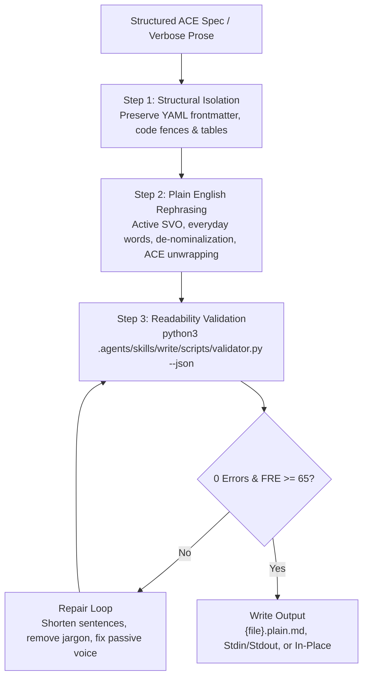

# Write: Plain English Readability & Token-Efficient Rephrasing Skill

The agent SHALL transform structured Agentic ACE specifications, technical documentation, and unstructured prose into clear, human-readable **Plain English** conforming to standard Plain English guidelines and the US Federal Plain Language standards.
The agent SHALL NOT use the `write` skill for creating or editing skills or agent contracts.
The agent SHALL use the `ace-write` skill for all skill definitions.



## 1. Dialect & Linguistic Invariants

Every rephrased statement MUST strictly obey these core linguistic invariants:

### Rule 1: Subject-Verb-Object (SVO) Active Voice
Every sentence MUST have an explicit actor performing an action. The agent SHALL NOT use passive voice constructions.

```text
[FORBIDDEN: Passive]: The configuration file is parsed by the worker process.
[REQUIRED: Active SVO]: The worker process parses the configuration file.
```

### Rule 2: Everyday Common Vocabulary
The agent SHALL replace multi-syllable Latinate, academic, or bureaucratic terms with common everyday equivalents defined in `assets/lexicon.yaml`.

```text
[FORBIDDEN]: The script will utilize expedited methods to terminate the task prior to timeout.
[REQUIRED]: The script will use fast methods to end the task before timeout.
```

### Rule 3: De-Nominalization (Unsmothering Verbs)
The agent SHALL convert smothered nouns derived from verbs back into direct active verbs.

```text
[FORBIDDEN]: The agent will make a determination and conduct an investigation.
[REQUIRED]: The agent will decide and investigate.
```

### Rule 4: Short Atomic Sentences
Sentences MUST NOT exceed 20 words. The target average sentence length is 10 to 15 words. The agent SHALL split chained compound sentences into separate sentences or bullet points.

### Rule 5: Agentic ACE De-compilation
The agent SHALL unwrap formal ACE contract blocks (`GIVEN`, `WHEN`, `THEN`, `INVARIANT`) and rigid modals (`SHALL`, `MUST`) into natural active prose and bulleted lists.

```text
[SOURCE ACE]:
GIVEN a valid authentication token.
WHEN the user requests user profile data.
THEN the API SHALL return profile fields in JSON format.
INVARIANT the API SHALL NOT expose password hashes.

[REPHRASED PLAIN ENGLISH]:
When a user requests their profile with a valid token, the API returns the profile fields in JSON. The API never returns password hashes.
```

### Rule 6: Elimination of Throat-Clearing and Filler
The agent SHALL delete introductory fluff, throat-clearing preambles, and redundant modifiers.

```text
[FORBIDDEN]: It is important to note that, in light of the fact that memory is limited, cleanup is needed.
[REQUIRED]: Because memory is limited, clean up unused resources.
```

### Rule 7: Structural Bulleting
The agent SHALL format multi-item lists, branching conditions, and procedures using concise markdown bullet points.

## 2. Operational Procedures

### Procedure A: Inline Text and Stdin Transformation
WHEN a user or agent provides raw text or pipes via stdin:
1. The agent SHALL isolate all code snippets, URLs, and structured data payloads.
2. The agent SHALL rephrase all prose into active SVO, everyday vocabulary, and short sentences.
3. The agent SHALL verify the candidate text with the validator tool:
   ```bash
   echo "<candidate_text>" | python3 .agents/skills/write/scripts/validator.py --json
   ```
4. IF the validator reports diagnostic errors or a Flesch score below 65, THEN the agent SHALL apply iterative corrections until 0 errors remain.
5. The agent SHALL return the verified text.

### Procedure B: Single File Transformation
WHEN the user or agent provides a target file path:
1. The agent SHALL read the target file using the file viewer tool.
2. The agent SHALL preserve YAML frontmatter headers, code fences, and tables verbatim.
3. The agent SHALL rephrase markdown headers, paragraphs, and list items into Plain English.
4. The agent SHALL determine the output destination:
   - IF the user provides `--in-place`, THEN the agent SHALL overwrite the original file.
   - IF the user does not provide `--in-place`, THEN the agent SHALL write to `{directory}/{stem}.plain.md`.
5. The agent SHALL validate the destination file:
   ```bash
   python3 .agents/skills/write/scripts/validator.py <target_path> --json
   ```
6. IF the validator reports violations, THEN the agent SHALL apply iterative corrections until 0 errors remain.

### Procedure C: Directory Batch Processing
WHEN the user provides a directory path:
1. The agent SHALL locate all markdown files within the target directory.
2. The agent SHALL execute Procedure B on each discovered file.
3. The agent SHALL run batch validation across the directory:
   ```bash
   python3 .agents/skills/write/scripts/validator.py <directory_path>
   ```

### Procedure D: Conformance and Readability Linting
WHEN the user requests a dry-run check without modifying files:
1. The agent SHALL execute the validator in check mode:
   ```bash
   python3 .agents/skills/write/scripts/validator.py <target_path>
   ```
2. The agent SHALL report all discovered readability violations and metrics.

## 3. Transformation Reference Examples

### Example 1: Agentic ACE Specification Transformation
```text
[SOURCE AGENTIC ACE]:
GIVEN the environment contains a valid database connection string.
WHEN the agent executes the data migration script.
THEN the script SHALL apply pending schema migrations within 30 seconds.
INVARIANT the migration script SHALL NOT drop existing production tables.

[REPHRASED PLAIN ENGLISH]:
With a valid database connection, the migration script applies pending schema updates within 30 seconds. The script never drops existing production tables.
```

### Example 2: Verbose Technical Documentation
```text
[SOURCE VERBOSE PROSE]:
It should be noted that in order to facilitate the expeditious transmission of log files, the daemon will make a determination regarding network bandwidth prior to initiating transfer operations.

[REPHRASED PLAIN ENGLISH]:
To send log files quickly, the daemon checks network bandwidth before starting transfers.
```

## 4. Verification Checklist

WHEN completing any task with the `write` skill, THEN the agent SHALL verify:
1. `python3 .agents/skills/write/scripts/validator.py <file>` returns exit code 0.
2. The Flesch Reading Ease score meets or exceeds 65.0 (Grade Level $\le 8.0$).
3. All sentences contain 20 words or fewer.
4. Zero passive voice constructions remain in prose.
5. Zero bureaucratic terms from `assets/lexicon.yaml` remain in prose.
6. All code blocks, tables, and YAML frontmatter match original contents verbatim.
